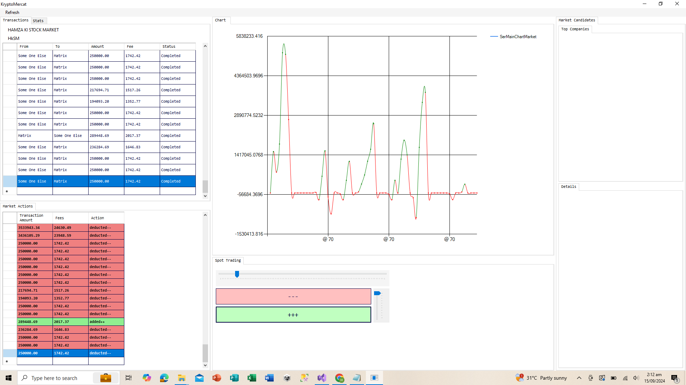
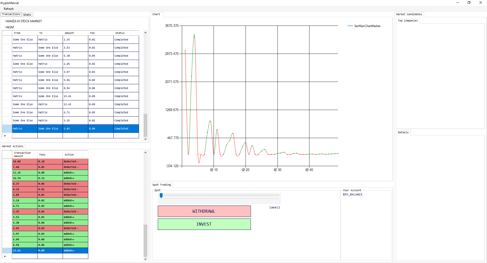
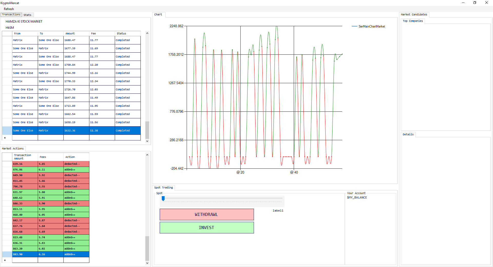
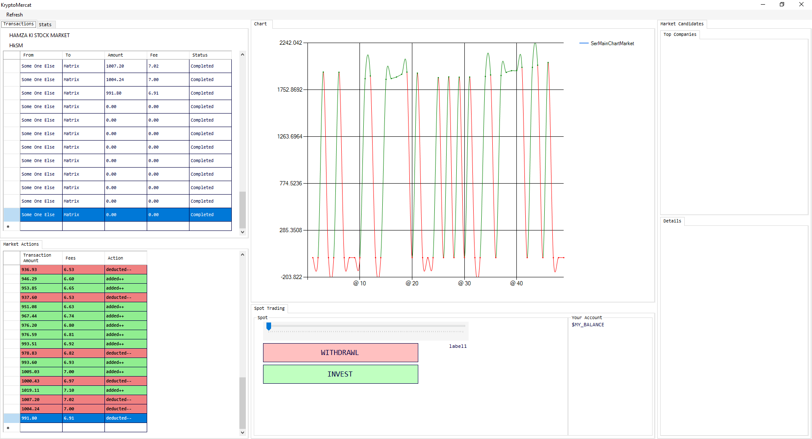
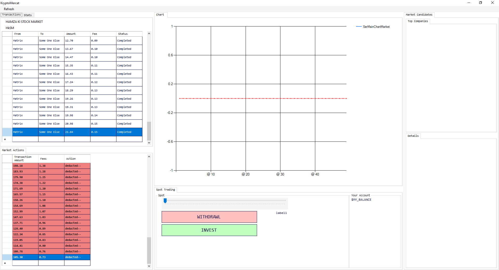
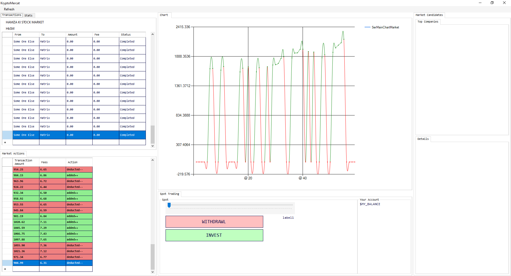
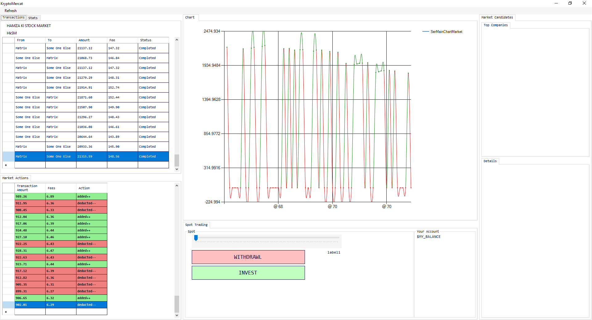
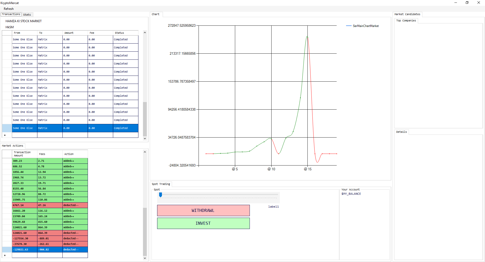
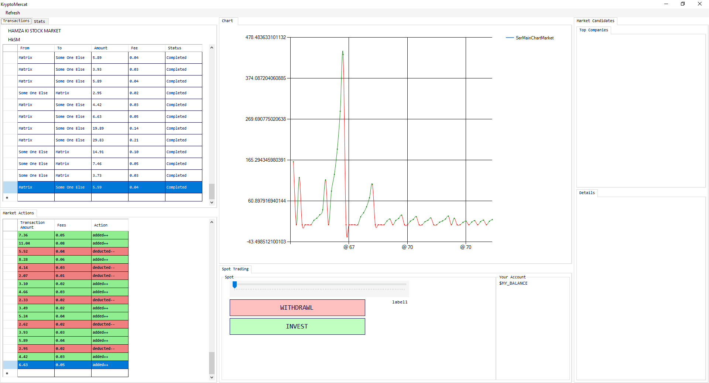

# Virtual Stock Market 🏦📈


> ## It tries to behave like a real stock market... but hey, it's riddled with bugs and flaws! Plenty for me to fix 🛠️.

This simulation mimics stock market fluctuations using a basic mechanism: starting with an initial price, it bounces within a range of ±x%. The fun part? It depends on 4 or maybe 5 prebuilt algorithms (yes, you can make your own too). It's a simple, chaotic attempt to capture the wild ride of stock markets. Don't expect miracles, though—it's mostly an entertaining disaster! 😂

## **Built in C# 🎉:** Because C# is OP! Seriously, you should be using it too.
## This project is built with WinForms, .NET 8.0, and C# 9.0 (I think? 🤔).




## Algorithms

- A quick peek at the motley crew of algorithms running the show. Spoiler: Most of them are catastrophic failures. 😅

# **Random Walk 🐾**
> ### A complete disaster! 🚨

```csharp
// 1. Random Walk Algorithm
public static List<double> RandomWalk(string companyName, double initialPrice, int timeLineLength = 3)
{
    List<double> timeline = new List<double>();
    double price = initialPrice;

    for (int i = 0; i < timeLineLength; i++)
    {
        double fluctuation = random.NextDouble() * 0.05 * price * (random.Next(0, 2) == 0 ? -1 : 1); // ±5% fluctuation
        price += fluctuation;
        timeline.Add(Math.Round(price, 2));
    }

    return timeline;
}
```



# **Geometric Brownian Motion 📉**
> ### Yet another failure. Keep expectations low!

```csharp
 // 2. Geometric Brownian Motion
 public static List<double> GeometricBrownianMotion(string companyName, double initialPrice, int timeLineLength = 3, double volatility = 0.02)
 {
     List<double> timeline = new List<double>();
     double price = initialPrice;

     for (int i = 0; i < timeLineLength; i++)
     {
         double randomShock = volatility * price * random.NextDouble() * (random.Next(0, 2) == 0 ? -1 : 1); // ± volatility
         price += randomShock;
         timeline.Add(Math.Round(price, 2));
     }

     return timeline;
 }
```




# **Mean-Reverting 📊**
> ### Ah, another failure. Surprise, surprise!

```csharp
 // 3. Mean-Reverting Algorithm
 public static List<double> MeanReverting(string companyName, double initialPrice, int timeLineLength = 3, double longTermMean = 30, double speed = 0.05)
 {
     List<double> timeline = new List<double>();
     double price = initialPrice;

     for (int i = 0; i < timeLineLength; i++)
     {
         double drift = speed * (longTermMean - price); // Pulls price towards the mean
         double randomShock = random.NextDouble() * 0.03 * price * (random.Next(0, 2) == 0 ? -1 : 1); // Random fluctuation ±3%
         price += drift + randomShock;
         timeline.Add(Math.Round(price, 2));
     }

     return timeline;
 }
```



# **Mean-Averaging ⚖️**
> ### Failure once again! Third time's not the charm!

```csharp
 // 4. Mean-Averaging Algorithm
 public static List<double> MeanAveraging(string companyName, double initialPrice, int timeLineLength = 3)
 {
     List<double> timeline = new List<double>();
     double price = initialPrice;
     double totalSum = 0;

     for (int i = 0; i < timeLineLength; i++)
     {
         double fluctuation = random.NextDouble() * 0.05 * price * (random.Next(0, 2) == 0 ? -1 : 1); // ±5% fluctuation
         price += fluctuation;
         totalSum += price;
         timeline.Add(Math.Round(price, 2));
     }

     double meanPrice = totalSum / timeLineLength;
     timeline.Add(Math.Round(meanPrice, 2));  // Append the mean price to the timeline

     return timeline;
 }
```




# **Subtle Incremental Changes 📈**
> ### Small win! Hey, progress!

```csharp
public static List<double> SubtleIncrementalChanges(string companyName, double initialPrice, int timeLineLength = 3)
{
    if (timeLineLength < 0) { timeLineLength = 2; }
    if (initialPrice <= 0) { initialPrice = StockMarket.Market_Value_Now + 25000; StockMarket.Market_Value_Now = StockMarket.Market_Value_Now + 25000; }

    List<double> timeline = new List<double>();
    Random random = new Random();
    double price = initialPrice;

    // Realistic price bounds
    double minPrice = 0.1 * initialPrice;  // Minimum price bound (10% of initial)
    double maxPrice = 10.0 * initialPrice; // Maximum price bound (10x initial)

    // Parameters for realistic market fluctuations
    double baseGrowthRate = 0.005;         // Base 0.5% growth rate
    double baseDropRate = -0.005;          // Base -0.5% drop rate
    double volatilityFactor = 0.02;        // Additional volatility (±2%)
    double correctionChance = 0.1;         // 10% chance for a market correction
    double correctionMagnitude = -0.15;    // Market correction reduces price by 15%
    double spikeChance = 0.05;             // 5% chance of a large spike
    double spikeMagnitude = 0.2;           // Spike adds 20% to the price

    int turns = timeLineLength;  // Total number of turns (upward and downward)

    // Loop through both increasing and decreasing phases with random market-like behavior
    for (int i = 0; i < turns; i++)
    {
        // Determine if the market is growing or dropping (random direction)
        bool isGrowing = random.NextDouble() > 0.5;

        double changePercent = isGrowing ? baseGrowthRate : baseDropRate;  // Base growth or drop

        // Introduce volatility by adding a random percentage fluctuation
        double volatility = (random.NextDouble() * 2 - 1) * volatilityFactor; // Random ±2%
        changePercent += volatility;

        // Market correction: 10% chance of a sudden drop
        if (random.NextDouble() < correctionChance)
        {
            changePercent += correctionMagnitude;  // Drop by 15%
        }

        // Occasional spike: 5% chance of a spike
        if (random.NextDouble() < spikeChance)
        {
            changePercent += spikeMagnitude;  // Increase by 20%
        }

        // Adjust the price based on the percentage change
        price += price * changePercent;

        // Ensure price stays within realistic bounds
        price = Math.Max(minPrice, Math.Min(price, maxPrice));

        // Round the price and add to the timeline
        double roundedPrice = Math.Round(price, 2);
        timeline.Add(roundedPrice);
    }

    // Simulate the second phase of gradual correction or adjustment
    for (int i = 0; i < turns; i++)
    {
        // Switch between slight increases and decreases with less volatility
        bool isGrowing = random.NextDouble() > 0.5;

        double changePercent = isGrowing ? baseGrowthRate / 2 : baseDropRate / 2;  // Reduced growth/drop

        // Lower volatility for the correction phase
        double volatility = (random.NextDouble() * 2 - 1) * (volatilityFactor / 2); // Reduced volatility
        changePercent += volatility;

        // Keep occasional corrections and spikes
        if (random.NextDouble() < correctionChance / 2)  // Less likely correction
        {
            changePercent += correctionMagnitude / 2;   // Smaller correction
        }
        if (random.NextDouble() < spikeChance / 2)      // Less likely spike
        {
            changePercent += spikeMagnitude / 2;        // Smaller spike
        }

        // Adjust the price
        price += price * changePercent;

        // Ensure price stays within realistic bounds
        price = Math.Max(minPrice, Math.Min(price, maxPrice));

        // Round the price and add to the timeline
        double roundedPrice = Math.Round(price, 2);
        timeline.Add(roundedPrice);
    }

    return timeline;
}
```




# **Plus and Minus ➕➖**
> ### First attempt without ChatGPT. Mixed results, mostly failures.

```csharp
public static List<double> plus_and_minus(double initialPrice, int days, double volatility)
{
    Random random = new Random();

    List<double> prices = new List<double> { initialPrice };

    for (int i = 1; i < days; i++)
    {
        double changePercent = NextGaussian(0, volatility);
        double newPrice = prices[i - 1] * (1 + changePercent);
        prices.Add(newPrice);
    }

    return prices;
}

// Helper method to generate random numbers from a Gaussian distribution
public static double NextGaussian(double mean, double standardDeviation)
{
    double u1 = 1.0 - random.NextDouble();
    double u2 = 1.0 - random.NextDouble();
    double randomStandardNormal = Math.Sqrt(-2.0 * Math.Log(u1)) * Math.Sin(2.0 * Math.PI * u2);
    return mean + standardDeviation * randomStandardNormal;
}
```



# **THE REAL ALGO™ 💡**
> ### Finally, some success! 🏆

```csharp
public static List<double> THE_REAL_ALGO(double initialPrice, int days)
{
    Random random = new Random();
    List<double> prices = new List<double> { initialPrice };
    double changePercent = 0.5; // 0.05% as a decimal
    for (int i = 1; i < days; i++)
    {
        // Generate a random number between 0 and 1
        double direction = random.NextDouble();
        // Calculate new price based on direction
        double newPrice;
        if (direction < 0.5)
        {
            // Decrease by 0.05%, but only if it stays above 2
            newPrice = prices[i - 1] * (1 - changePercent);
            if (newPrice < 2)
            {
                newPrice = prices[i - 1] * (1 + changePercent); // Force increase if pricedrops below 2
            }
        }
        else
        {
            // Increase by 0.05%
            newPrice = prices[i - 1] * (1 + changePercent);
        }
        if (newPrice < 2)
        {
            newPrice = 2.5;
        }        
        // Add the new price to the list
        prices.Add(newPrice);
    }
    return prices;
}

```



## **KNOWN BUGS 🐞**

> # EVERYTHING... including the chart simulation system too! LOL!


